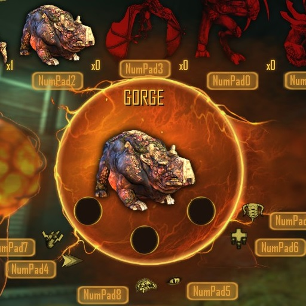

# Notice
Feel free to fork the project or include it in your own mods/mod-packs.
However, no support is provided whatsoever.
All pull requests and issues posted to this tracker will be ignored.

# BuyMenuHotkeys
LUA mod for Natural Selection 2 that adds hotkeys for the alien and marine buy menus.
Available in the [steam workshop](http://steamcommunity.com/sharedfiles/filedetails/?id=178532446).

ModID: aa4305e

## Features
Configuration options are in the keybinding settings menu.
The large button labels can be disabled by setting 'HUD Quality' to 'Minimum" or by setting the 'BMHK Label Scale' to 0.

## License
This project is released to the public domain and may be freely used for any purpose.
Public Domain license of these files does not supercede any Copyrights or Trademarks of
Unknown Worlds Entertainment, Inc.
Natural Selection 2, its Assets, Source Code, Documentation, and Utilities are
Copyright Unknown Worlds Entertainment, Inc. All rights reserved.

This sofware is provided "as-is". No warranty or support of any kind is or will be provided.

See [LICENSE](LICENSE) for more details.

## Default Keybindings
### Alien
Key Bind | Function
-------- | --------
NumPadEnter | Begin Evolving
1 | Select Gorge
2 | Select Skulk
3 | Select Lerk
4 | Select Fade
5 | Select Onos
NumPad9 | Select Crush
NumPad6 | Select Carapace
NumPad3 | Select Regeneration
NumPad8 | Select Focus (not used in current game mode)
NumPad5 | Select Vampirism
NumPad2 | Select Aura
NumPad7 | Select Adrenaline
NumPad4 | Select Celerity
NumPad1 | Select Silence

### Armory
Key Bind | Function
-------- | --------
1 | Purchase Welder
2 | Purchase Mines
3 | Purchase Shotgun
4 | Purchase Cluster Grenades
5 | Purchase Nerve Gas
6 | Purchase Pulse Grenades
7 | Purchase Grenade Launcher
8 | Purchase Flamethrower
9 | Purchase Heavy Machine Gun

### Prototype Lab:
Key Bind | Function
-------- | --------
1 | Purchase Jetpack
2 | Purchase Minigun Exo
3 | Purchase Railgun Exo
1 | Purchase Dual-Exo Upgrade (not used in current game mode)
